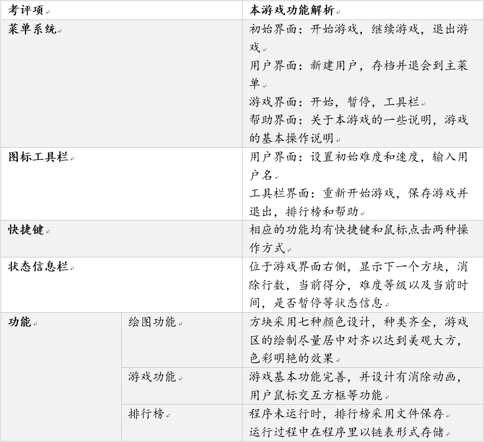
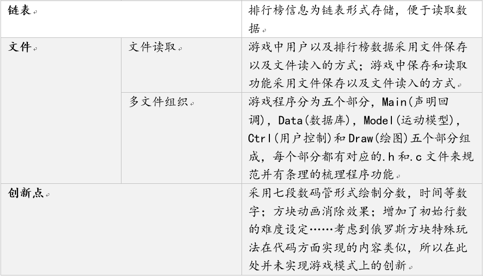

## 关于本项目

本项目为浙江大学本科课程程序设计专题大作业，采用教师提供的图形库绘制图案，纯C语言编写。

本项目由三人合作编写，十分感谢童同学对整个程序图形界面的制作和美化，以及贾同学对文件操作代码的编写和细节完善！

项目最初采用Dev C++编译运行，后改为Visual Studio；不能保证两者代码功能完全一致

如果编译发生错误，可能为文件目录等细节需要调整，如果想直接查看结果，请运行文件Tetris.exe

## 项目内容说明

> 本项目说明主要按照课程要求说明，仅供参考

## 游玩说明

> 游戏支持快捷键以及鼠标点击操作
>
> **建议开启大写锁定或英文输入法进行游戏**

### 初始界面

* 按下 `S` 或点击开始游戏可进入游戏界面

* 按下 `C` 或点击读入存档可继续保存的游戏，如果没有存档则没有反应

* 按下 `R ` 或点击排行榜可查看排行榜信息

* 按下 `H` 或点击帮助可查看游戏操作说明

* 按下 `Q` 或点击退出游戏可关闭游戏窗口

### 用户输入界面

* **需要输入用户名后方可进行游戏**

* 用户名**仅限字母且不超过八个**，直接按下键盘输入即可

* 在用户未输入用户名时，会跳出相应的的提示，提醒用户

* 按下方向键 `↑ ↓/← →` 或点击相应的 `+/-` 可调整初始难度和行数

* 按下`Enter`或点击**GO**可开始游戏（见下图，图为鼠标点击**GO**的效果）

### 游戏界面

* 按下 `←` `→` 可移动方块

* 按下 `↑` 可旋转方块

* 按下 `↓` 可加速方块下落

* 按下空格可将方块直接落至底部

* 按下 `P` 或点击暂停标志可暂停游戏

* 按下 `T` 或点击工具栏可打开工具栏

* 右下角实时显示当前时间，暂停时三角符号会闪动

### 工具栏界面

按下 `N` 或点击新游戏可回到用户界面重新开始游戏

按下 `C` 或点击继续游戏可回到游戏界面继续当前游戏

按下 `R` 或点击排行榜可查看排行榜信息

按下 `H` 或点击帮助可查看游戏操作说明

按下 `B` 或点击保存并退出可保存当前游戏，并在初始界面中读入存档
